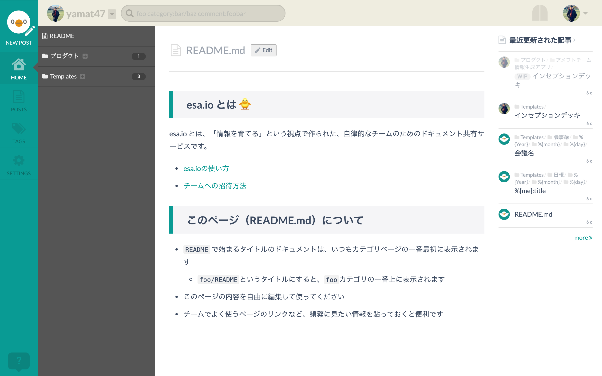
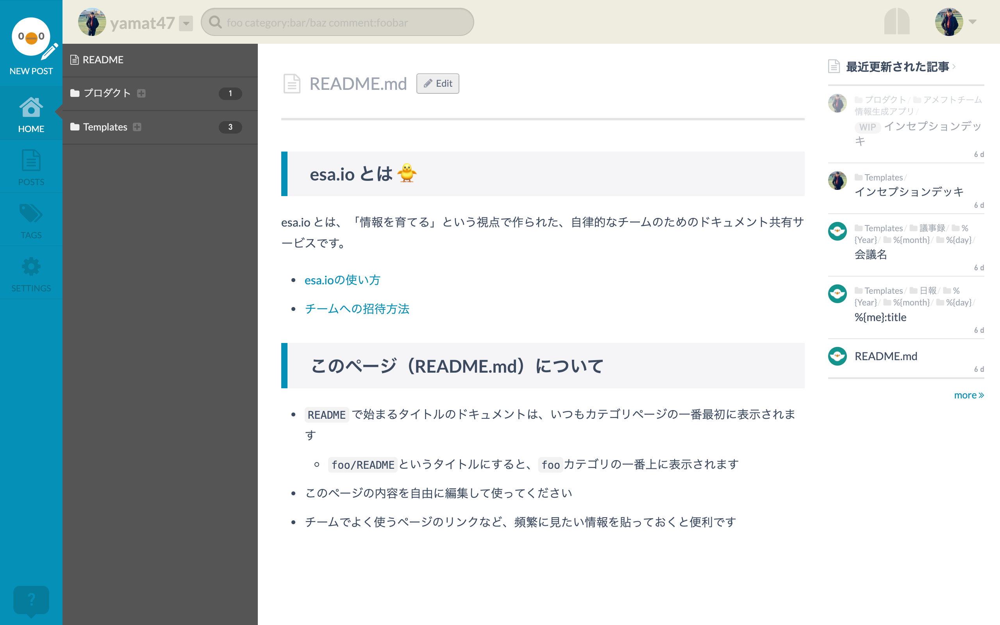
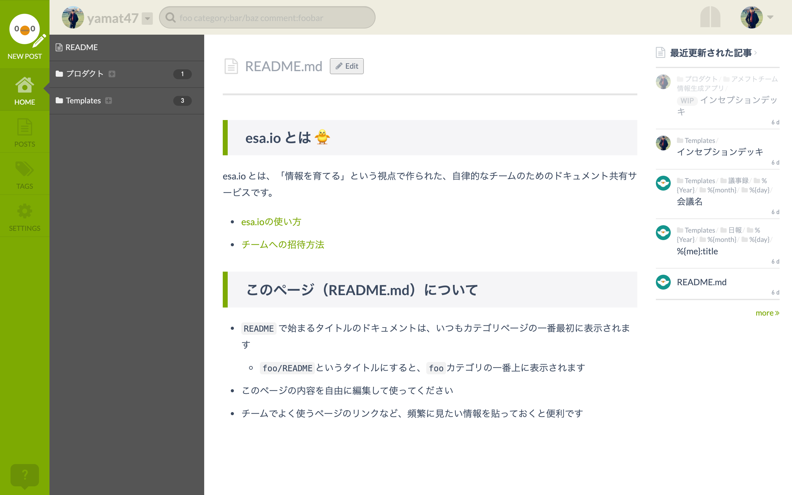
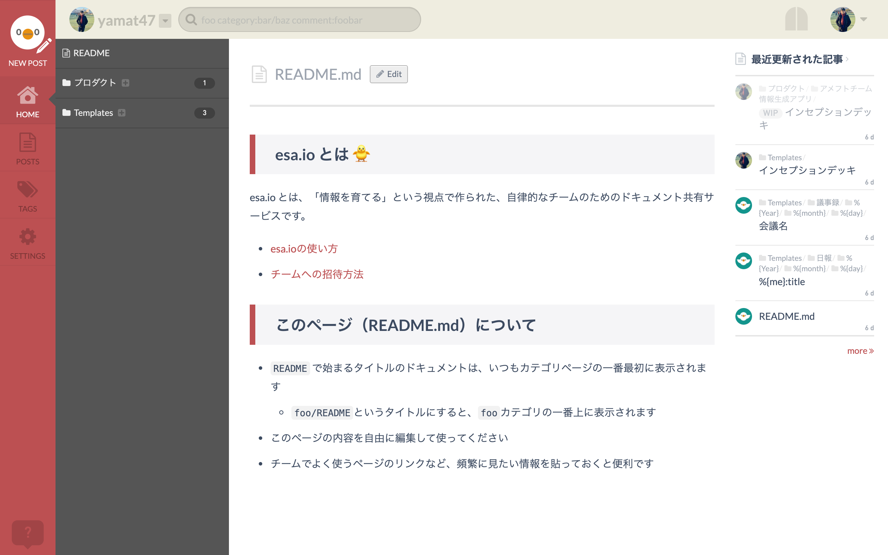

Esa Costume
====

Chrome or Firefox extension which provides custom styles for [esa.io](https://esa.io) documents.

* Emphasize markdown h2 and h3 header.
* Show icons for side navigation and breadcrumbs.

Screenshots
----

Installaion
----

### Install from web store (Recommended)

Visit web store for your browser and install it.

* [Chrome extension page](https://chrome.google.com/webstore/detail/esa-costume/oibomcmdlkbipnlanafiefdihinokdck)
* [Firefox add-on page](https://addons.mozilla.org/ja/firefox/addon/esa-costume/)

### Install manually

* Open `chrome://extensions`.
* Enable developer mode.
* Click on "Load Unpacked" and select this repository.

License
----

[MIT](./LICENCE.txt)

Contribution
----

1. Fork [yamat47/esa-costume](https://github.com/yamat47/esa-costume/fork).
2. Create a feature branch.
3. Commit your changes.
4. Rebase your local changes against the master branch.
6. Run `npm run lint` and confirm the result.
7. Create new Pull Request.

Author
----

[yamat47 (yamaguchi.takuya)](https://github.com/yamat47)
